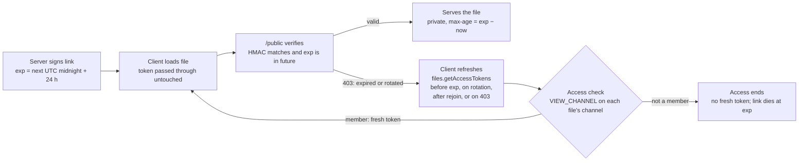

# Expiring Private Channel File Links

Plan for making private channel file links stop working within 48 hours of
being issued. Losing access to a channel then ends file access on its own,
without breaking links for anyone who keeps access. Status: release N (the
refresh path, no expiry yet) is implemented; release N+1 (expiry) is not.

## Problem and goals

**The problem today**

- A file link carries an HMAC over the file ID and the channel's
  `fileAccessToken`. Nothing in it names a user or a time.
- That token only changes when an admin presses rotate in channel settings.
  Kicks, bans, role changes and permission edits leave it alone.
- `/public` checks no session. Whoever holds the URL keeps access indefinitely:
  the removed user, and anyone they paste it to.

**Goals**

- A private channel file link expires no later than 48 hours after it was
  issued.
- Members who keep access never see a broken file, including in a desktop
  session left open for days.
- No revocation hooks in the kick, ban, role or permission code paths.

**Out of scope**

- Immediate revocation. The existing rotate button stays the tool for that.
- Public channel files, avatars and banners. They stay public and non-expiring.
- Copies already cached at the CDN. One Cloudflare purge after the cache-header
  change ships covers them.
- Per-user tokens or session-authenticated file requests.

## Current behaviour

The server signs a fresh token every time it sends a private channel file to a
client. The token is deterministic, so every signing produces the same value
until an admin rotates.

| Step | Where | What happens |
| --- | --- | --- |
| Sign | `apps/server/src/helpers/files-crypto.ts:4` | HMAC-SHA256 over `fileId:fileAccessToken`, keyed by the server token |
| Issue on message list | `apps/server/src/routers/messages/get-messages.ts:111` | Every page of messages carries a signed `_accessToken` per file |
| Issue on push | `apps/server/src/db/queries/messages.ts:47`, called from `db/publishers.ts:42` | `NEW_MESSAGE` and `MESSAGE_UPDATE` events carry signed files |
| Issue on user file list | `apps/server/src/db/queries/files.ts:81`, called from `routers/users/get-user-info.ts:28` | Moderator view of a user's uploads. The route checks only `MANAGE_USERS`, so it signs every private file regardless of the caller's channel access |
| Verify | `apps/server/src/http/public.ts:119` | Constant-time compare; 403 on mismatch |
| Rotate | `apps/server/src/routers/channels/rotate-file-access-token.ts:32` | New `fileAccessToken`; no event is sent to clients |
| Build URL | `apps/client/src/helpers/get-file-url.ts:37` | `/public/<name>?accessToken=<token>&v=<fileId>`; the token is opaque to the client |

**Client behaviour that matters here**

- `useMessages` fetches each channel once and keeps the messages for the
  session. A later fetch skips message IDs it already holds, so their tokens
  are never replaced (`apps/client/src/features/server/messages/hooks.ts:39-40`).
- A `MESSAGE_UPDATE` event replaces the whole message through `updateMessage`,
  files included (`features/server/messages/actions.ts:43`).
- A failed inline image renders nothing
  (`components/channel-view/text/overrides/image.tsx:23` and `:37`).
- Download cards are plain `<a href>` links
  (`components/channel-view/text/file-card.tsx:51`). Messages and the
  moderator sheet both use them; the sheet renders nothing else
  (`components/mod-view-sheet/server-activity/files.tsx`).
- The packaged desktop app runs its own bundled client from `file://`. Client
  changes only reach it through an app update.

The comment at `get-messages.ts:104-110` calls shareable, non-expiring links
"by design". This change reverses that decision.

## Design

The expiry goes inside the existing token: `<exp>.<hmac>`, where the HMAC now
covers `fileId:fileAccessToken:exp`. The client still passes the token through
untouched, so the URL shape does not change.

Revocation happens wherever a token is signed. Every signing path checks the
caller's `VIEW_CHANNEL` on the file's channel, so a removed user's last link
dies at its `exp`. That includes the moderator file list, which today signs on
`MANAGE_USERS` alone.

**Token**

- `exp` is a Unix timestamp in seconds: the next UTC midnight plus 24 hours. A
  link therefore lives between 24 and 48 hours.
- Every token issued for a file on the same UTC day is identical. The URL stays
  stable all day, so the browser cache keeps working.
- `fileAccessToken` stays in the HMAC. The rotate button still makes the
  server refuse every link in a channel at once.
- This mirrors Discord's signed CDN links (`ex`, `is`, `hm`, about 24 hours),
  folded into our one opaque parameter.

**Verification**

- Split on the first `.`. Reject a missing or non-numeric `exp`, or one at or
  before the current time.
- Recompute the HMAC with that `exp` and compare in constant time, as today.
- Old-format tokens (a bare 64-character hex HMAC) are rejected. That is what
  ends access through links issued before the change.

**Caching**

- Private channel responses send `private, max-age=<exp − now>, immutable`. No
  cache that honours the header can serve a file past its link's expiry.
- Public files keep `public, max-age=31536000, immutable`.
- Expiry and rotation stop the server serving a link. They do not reach a copy
  a browser already downloaded: that browser can keep showing it without
  contacting `/public` until its `max-age` runs out, at most 48 hours. Those
  bytes are already on that machine, so `no-cache` would cost a revalidation on
  every image load without taking anything back. The plan keeps browser
  caching and only claims server-side revocation.

**Why expiry instead of rotating on membership changes**

- One place to get right. Rotation needs a hook in every path that changes
  access: role assignment, channel permission overrides, kick, ban, user
  deletion and the private toggle. A missed path is a silent hole.
- No disruption for members who keep access. Rotation breaks every loaded link
  in the channel each time one person leaves.
- It also ends links that leaked outside the app, which rotation only does when
  someone remembers to press the button.

## Server changes

The token change lives in one helper. Two of the three places that issue
tokens pick it up without edits; the moderator file list needs a channel check
it lacks today. The new pieces are a small route that lets the client refresh
tokens, and an event that tells it when to.

1. **`apps/server/src/helpers/files-crypto.ts`**
    - `generateFileToken(fileId, channelAccessToken, now = Date.now())` computes
      `exp` and returns `${exp}.${hmac}`.
    - `verifyFileToken(...)` returns the parsed `exp` on success and `null`
      otherwise, so the handler can set `max-age`.
    - `now` is a parameter so tests can pin the clock.
2. **`apps/server/src/http/public.ts`**
    - Use the returned `exp` to set `private, max-age=<exp − now>, immutable` on
      the 200, 206 and 304 responses.
3. **Message token issuers** (`get-messages.ts:111`, `db/queries/messages.ts:47`)
    - No code change. They already sign only for users with `VIEW_CHANNEL` on
      the channel, and get the new format from `generateFileToken`.
4. **Moderator file list** (`db/queries/files.ts:81`, `routers/users/get-user-info.ts`)
    - Move signing out of `getFilesByUserId` into the route, and have the
      query return each file's channel ID instead.
    - Leave out files in private channels where `ctx.hasChannelPermission(channelId,
      ChannelPermission.VIEW_CHANNEL)` fails, checked once per distinct
      channel. Their names alone can leak private content, and the client never
      has to render a private file it cannot open.
    - This is an existing access-control gap. It can ship before expiry does.
5. **New route `files.getAccessTokens({ channelId, fileIds })`**
    - `ctx.needsChannelPermission(channelId, ChannelPermission.VIEW_CHANNEL)`,
      the same check `messages.get` makes. Every caller refreshes one channel.
    - Signs only files attached to messages in that channel, and only when the
      channel is private. Other IDs are left out of the result.
    - Caps `fileIds` at 100 per call.
    - Returns `{ fileId, accessToken }[]`.
6. **New event `CHANNEL_FILE_ACCESS_CHANGED { channelId }`**
    - Published to users with `VIEW_CHANNEL`, the same audience as message
      events (`db/publishers.ts:48`).
    - Sent by the rotate route (`rotate-file-access-token.ts`), which sends no
      event today.
    - Sent by `update-channel.ts` when `private` changes in either direction.
      Turning it on gives files loaded while the channel was public their
      tokens; turning it off clears tokens that are no longer needed.
    - The event serves availability, not revocation. A client that misses it
      falls back to the rejoin and retry triggers.

## Client changes

Every file URL is built from the store at render time, so the client keeps
the store's tokens current instead of intercepting clicks. Cards stay plain
links, and every way of opening one uses the current token.

1. **Store action** `setFileAccessTokens(channelId, requestedIds, tokens)` in
   `features/server/messages`. For each requested file in that channel's
   loaded messages, it sets the returned token, or clears `_accessToken` when
   the response leaves that file out. Clearing handles a channel that went
   public: its links work without a token, and the expiry trigger stops
   asking for them. Images, videos, audio and download cards all pick up the
   change on the next render.
2. **One refresh function** requests tokens for every loaded file in a
   channel, in batches of 100, and hands each response to the store action.
   It sends all file IDs, not only tokened ones, so a channel that just went
   private gets tokens. A failed request changes nothing in the store.
3. **Refresh triggers**
    - *Before expiry.* On mount, on window focus and on a timer, when any
      loaded token expires within 12 hours. The client reads `exp` from the
      token's prefix; a token with no `exp` never triggers. Refreshing 12
      hours early absorbs client clock skew, and a refreshed token still has
      at least 24 hours left.
    - *On `CHANNEL_FILE_ACCESS_CHANGED`* for a channel with loaded messages.
      This covers rotation and the private toggle.
    - *After a confirmed rejoin*, for every channel with loaded messages. This
      covers events missed while disconnected, and the server restart that
      delivers release N+1. The trigger is the reconnect `joinServer` call
      succeeding without `mustChangePassword` (`features/server/actions.ts:141-166`),
      not the raw socket reconnect, whose server context is still
      unauthenticated. No rejoin signal exists yet: add a counter to the server
      store, bumped there, that this refresh and the moderator sheet both
      watch.
    - *On a media load failure*, once per element (next item).
4. **Retry on failure.** When a tokened image, video or audio fails to load,
   refresh that channel once, then render again. A second failure shows a "file
   unavailable" placeholder instead of nothing.
5. **Remount on new URL.** `ImageOverride` and `VideoOverride` latch `error` and
   never reset it (`overrides/image.tsx:15` and `:37`, `overrides/video.tsx:15`
   and `:24`). The renderer keys them by index (`renderer/index.tsx:87` and
   `:91`). Key them by URL instead, so a new token remounts the element with a
   clean state.
6. **Download cards stay as they are.** `FileCard` remains a `target="_blank"`
   anchor (`file-card.tsx:49-54`). Left click, middle click, the context menu's
   open-in-new-tab and copy-link all use whatever `href` the store holds. No
   click waits on a request, so popup blockers never apply.
7. **Moderator sheet.** Its files live in `useAdminUserInfo`
   (`features/server/admin/hooks.ts:572`), outside the message store, so the
   message refresh never reaches them. While open, it refetches
   `users.getUserInfo` on window focus, when any listed token expires within
   12 hours (same helper), on any `CHANNEL_FILE_ACCESS_CHANGED`, and after a
   confirmed rejoin (the same counter). The rejoin refetch covers a rotation
   missed while disconnected.

**Accepted gaps**

- A card opened between a rotation and the refresh landing gets a 403. The
  next attempt works.
- A client clock more than 12 hours slow can refresh too late and open a 403.
  Media recovers through the retry; a card works after the next refresh
  trigger.

## Compatibility and rollout

Ship in three steps, so desktop apps already in use have the refresh code
before any link starts expiring.

1. **Cache-header change, then a purge.** Merge and deploy the
   `Cache-Control: private` fix for private channel files. Then run one Purge
   Everything in Cloudflare. No private file is held at the edge after that.
2. **Release N: refresh path, no expiry yet.** Add `files.getAccessTokens`,
   `CHANNEL_FILE_ACCESS_CHANGED`, the moderator file list channel check, and
   all the client changes. The server still issues and accepts today's
   tokens. They carry no `exp`, so the before-expiry trigger never fires, but
   rotation and rejoin refreshes already work.
3. **Release N+1: turn on expiry.** Switch `generateFileToken` and
   `verifyFileToken` to the new format. Old tokens stop validating, so every
   link issued before this release dies at once, including ones shared outside
   the app.

**Compatibility checks**

- **Browser client.** The server serves it, so it updates on deploy.
- **Packaged desktop app.** It runs its own bundled client. The token is opaque
  to it, so links still work on first load. A session left open past the
  link's lifetime on an app older than release N loses its images until it
  reloads or updates. That is an annoyance, not a security gap.
- **Release N client, release N+1 server.** Deploying N+1 restarts the server,
  so every client reconnects. The rejoin refresh replaces the old tokens
  before anyone needs them.
- **New desktop app, older self-hosted server.** The server issues no `exp`
  and sends no `CHANNEL_FILE_ACCESS_CHANGED`. Rejoin and retry refreshes
  call a route the server lacks; the client treats that error as no refresh.
  Media shows the placeholder after rotation, and cards behave as they do
  today.
- **Rotate button.** The server refuses every link in the channel
  immediately, and members' clients refresh on the new event. Browsers that
  already cached a file can still show it until its `max-age` runs out.

## Tests and validation

Unit tests pin the clock through the `now` parameter, so no test waits for a
real expiry. The rotate button exercises the retry path by hand without waiting
a day.

**Server** (`apps/server`, `bun test`)

- [ ] Token round-trips: a freshly issued token verifies and returns its `exp`.
- [ ] A token past `exp` is rejected.
- [ ] A token with an edited `exp` fails the HMAC check.
- [ ] An old-format token is rejected (release N+1 only).
- [ ] Two tokens for the same file on the same UTC day are identical. A token
      issued at 23:59 UTC lives at least 24 hours.
- [ ] `/public` sends `private, max-age=<exp − now>` on 200, 206 and 304, and
      403 for an expired token.
- [ ] `files.getAccessTokens` refuses a caller without `VIEW_CHANNEL` on the
      named channel, signs that channel's files when it is private, leaves out
      files from other channels and from public channels, and refuses more
      than 100 IDs.
- [ ] `users.getUserInfo` called by a `MANAGE_USERS` holder without
      `VIEW_CHANNEL` on a private channel leaves that channel's files out, and
      still returns public channel files without a token.
- [ ] Rotating a channel's token, and changing `private` in either direction,
      publish `CHANNEL_FILE_ACCESS_CHANGED` to users with `VIEW_CHANNEL` only.
      An update that leaves `private` alone publishes nothing.

**Client** (`apps/client`, `bun test`)

- [ ] `setFileAccessTokens` touches only requested files in the named channel.
      It sets returned tokens and clears `_accessToken` on requested files the
      response leaves out.
- [ ] The refresh check, extracted as a pure helper, never refreshes a token
      without `exp`, and refreshes one expiring within 12 hours.
- [ ] The refresh function sends every loaded file ID in the channel, tokened
      or not. A failed or missing route leaves the store unchanged.
- [ ] `CHANNEL_FILE_ACCESS_CHANGED` and a confirmed rejoin each refresh
      channels with loaded messages, and skip channels with none. A raw socket
      reconnect, or a rejoin that ends in `mustChangePassword`, refreshes
      nothing.
- [ ] An open moderator sheet refetches after a confirmed rejoin.

**By hand** (the `/verify` Playwright flow)

- [ ] Open a private channel with an image that is not in the browser cache,
      press rotate in channel settings, and confirm the image recovers
      through the retry path.
- [ ] After the rotate, open a download card in the channel and one in the
      moderator sheet by left click, middle click, and the context menu's
      open-in-new-tab. Each opens the file, in the browser and in the packaged
      desktop app.
- [ ] Throttle the network, rotate, and open a card before the refresh lands.
      Confirm it gets a 403 (the accepted gap) and the next attempt works.
- [ ] Open a public channel's download card and confirm it opens unchanged.
- [ ] With a channel and a moderator sheet open in one client, take that
      client offline. Rotate the channel's token from a second client, then
      bring the first back online. After it rejoins, cards in both the
      channel and the sheet open without a focus change.
- [ ] Make a private channel public and confirm its cards' `href`s lose the
      `accessToken` parameter and still open.

**CI**

- [ ] `bun run check-types`, `bun run lint`, and `bun run knip` for the new
      route, event and store action.

## Open questions

- [ ] **Link lifetime.** 24 to 48 hours as proposed, or longer, such as 7 days?
      A longer window means a removed user keeps access longer, but older
      desktop apps break less often and files are downloaded again less often.
- [ ] **Two releases or one?** The staged rollout costs a release cycle.
      Shipping in one release breaks long sessions on desktop apps that have
      not updated.
- [ ] **Desktop update uptake.** How quickly do desktop installs pick up a new
      release? That sets how long to wait between release N and N+1.
- [ ] **Links shared outside the app.** Does anyone rely on pasting private
      channel file links elsewhere? Those links will stop working within 48
      hours.
- [ ] **Moderator message history.** `users.getUserInfo` also returns the
      user's messages from every channel, private ones included, on
      `MANAGE_USERS` alone (`db/queries/messages.ts:83`). That is outside this
      plan. Is it intended for moderation, or does it need the same channel
      check?
