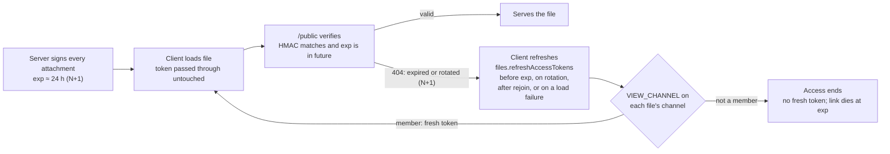

# Expiring File Attachment Links

Plan for making file attachment links expire about 24 hours after they are
issued, the way Discord's attachment CDN links do. Losing access to a channel
then ends file access on its own, links pasted outside the app stop working,
and nobody who keeps access sees a broken file. Status: release N (every
attachment signed, the refresh path, no expiry yet) is implemented; release
N+1 (expiry) is not.

## Problem and goals

**The problem before this work**

- Only private channel attachments carried a token: an HMAC over the file ID
  and the channel's `fileAccessToken`. Public channel attachments had none.
  Nothing in either link names a user or a time.
- That token only changes when an admin presses rotate in channel settings.
  Kicks, bans, role changes and permission edits leave it alone.
- `/public` checks no session. Whoever holds the URL keeps access indefinitely:
  the removed user, and anyone they paste it to.

**Goals**

- Every message attachment link, in every channel, expires about 24 hours after
  it was issued.
- Members who keep access never see a broken file, including in a desktop
  session left open for days. Healthy media does not reload or restart when its
  link is refreshed.
- No revocation hooks in the kick, ban, role or permission code paths.

**Out of scope**

- Avatars, banners, emojis and the server logo. They stay unsigned and
  non-expiring, as on Discord.
- Immediate revocation. The existing rotate button stays the tool for that.
- Per-user tokens or session-authenticated file requests.
- Re-signing attachment links pasted into message text. Discord refreshes those
  when it renders a message; Ripcord does not yet.

## Alignment with Discord

| Discord | Ripcord |
| --- | --- |
| Every attachment URL is signed (`ex`, `is`, `hm`) and expires after about 24 hours | Every attachment is signed from release N; links expire after about 24 hours from release N+1 |
| Avatars, emojis and other non-attachment CDN files are unsigned and never expire | Same |
| API payloads carry freshly signed URLs, and the client refreshes links silently | Same: message lists, push events and the moderator file list sign every attachment, and the client refreshes before expiry, on rotation, after a rejoin and on a load failure |
| A refresh endpoint takes a list of URLs from any channel | `files.refreshAccessTokens({ fileIds })` takes up to 100 file IDs from any channel |
| Expired or unsigned links return 404 ("This content is no longer available") | 404 from release N+1; 403 until then |
| The CDN checks signatures and caches attachments | Optional in release N+1: edge caching capped at each link's expiry |

**Deliberate deviations**

- **One opaque `accessToken` parameter** instead of `ex`, `is` and `hm`. Shipped
  desktop apps build file URLs by passing that token through untouched, so
  keeping it lets them work unchanged. It carries the same information:
  `<exp>.<hmac>`.
- **The refresh endpoint checks `VIEW_CHANNEL`.** Discord's is documented as
  accepting any URL. The point here is that a user who loses access to a
  channel gets no fresh link, so it signs only attachments in channels the
  caller can view.
- **The rotate button stays.** Discord has no equivalent. It makes the server
  refuse every link in a channel at once.

## Design

Revocation happens wherever a token is signed. Every signing path checks the
caller's `VIEW_CHANNEL` on the file's channel, so a removed user's last link
dies at its `exp`.

**Token**

- Today: an HMAC over `fileId:fileAccessToken`, keyed by the server token.
- From N+1: `<exp>.<hmac>`, where the HMAC covers `fileId:fileAccessToken:exp`
  and `exp` is a Unix timestamp in seconds: the start of the current 6-hour UTC
  window plus 24 hours. A link lives 18 to 24 hours, and every signing of a
  file within one window gives the same URL, so browser caching keeps working.
- `fileAccessToken` stays in the HMAC, so rotation still refuses every link in
  a channel. A private toggle changes nothing about tokens: every attachment is
  already signed.

**Verification (N+1)**

- Split on the first `.`. Reject a missing or non-numeric `exp`, or one at or
  before the current time.
- Recompute the HMAC with that `exp` and compare in constant time.
- Require a valid token on every attachment, public channels included.
  Old-format tokens and tokenless attachment URLs stop working, which ends
  access through every link issued before N+1, including ones shared outside
  the app.
- Answer an invalid, expired or missing signature with 404, like Discord.

**Caching**

- Today (#318): every attachment is `private, max-age=172800, immutable`, so no
  shared cache keeps one. Avatars, banners, emojis and the logo are
  `public, max-age=31536000, immutable`.
- From N+1: attachments send `max-age=<exp − now>`, so no cache that honours
  the header holds a file past its link's expiry.
- Optional in N+1: once every attachment link is signed and expiring, the CDN
  can cache attachments again (`public`, capped at `exp − now`). The cost is
  that rotation stops the origin immediately, but copies already at the edge
  live until their link expires unless someone purges. That would change
  #318's headers again.
- Expiry and rotation do not reach a copy a browser already downloaded. Those
  bytes are already on that machine; the plan claims server-side revocation
  only.

**Why expiry instead of rotating on membership changes**

- One place to get right. Rotation needs a hook in every path that changes
  access: role assignment, channel permission overrides, kick, ban, user
  deletion and the private toggle. A missed path is a silent hole.
- It also ends links that leaked outside the app, which rotation only does when
  someone remembers to press the button.

## Release N (implemented)

**Server**

1. **Every attachment is signed** in the message list (`messages.get`), push
   events (`getMessage` in `db/queries/messages.ts`) and the moderator file
   list (`users.getInfo`), whatever the channel's privacy.
2. **Moderator file list.** `getFilesByUserId` returns unsigned files with
   their channel. `users.getInfo` leaves out files in private channels the
   caller cannot view (checked once per channel; their names alone can leak
   private content) and signs every other attachment. `MANAGE_USERS` alone used
   to sign every private file.
3. **`files.refreshAccessTokens({ fileIds })`**, up to 100 IDs from any
   channels. Checks `VIEW_CHANNEL` once per distinct channel and signs only
   message attachments in channels the caller can view. Unknown IDs,
   non-attachments and files the caller cannot view are left out. Returns
   `{ fileId, accessToken }[]`.
4. **`CHANNEL_FILE_ACCESS_CHANGED { channelId }`**, sent by the rotate route to
   users with `VIEW_CHANNEL`. It serves availability, not revocation: a client
   that misses it falls back to the rejoin and retry refreshes.

`/public` still accepts tokenless public-channel requests and today's tokens.

**Client**

File URLs are built from the store at render time, so keeping the store's
tokens current keeps every card, link and player current. Cards stay plain
links, so no click waits on a request.

1. **`setFileAccessTokens(tokens)`** sets each returned token wherever that
   file is loaded. Files the response leaves out keep their token.
2. **One refresh function** (`features/server/messages/file-access-refresher.ts`)
   requests tokens in batches of 100. A file asked for again while its request
   is in flight is requested once more after it. A failed request leaves its
   files unchanged, and a response that lands after the client moved to another
   server is dropped.
3. **Refresh triggers**
    - *Before expiry*: on mount, window focus and a 15-minute timer, for loaded
      files whose token expires within 12 hours. A token without `exp` never
      triggers.
    - *On `CHANNEL_FILE_ACCESS_CHANGED`*: that channel's loaded files.
    - *After a confirmed rejoin* (a reconnect `joinServer` that succeeds
      without `mustChangePassword`, signalled by a counter in the server store):
      every loaded file. This covers rotations missed while disconnected, and
      the server restart that delivers N+1.
    - *On a media load failure*: the file's channel (next item).
4. **Media players keep a working link.** A player that loaded keeps the URL
   it loaded with when a refresh changes the stored one, so healthy images do
   not reload and playing media does not restart. A player that has not loaded
   yet, or that failed, takes the stored URL and is keyed by it.
5. **Retry on failure.** A failed player first tries a newer stored link if
   there is one. Otherwise a tokened link refreshes the channel's tokens once
   for that link, then renders again; a link that still fails shows a "File
   unavailable" placeholder instead of nothing.
6. **Moderator sheet.** Its files live outside the message store, so it
   refreshes their tokens through the same endpoint on the same triggers:
   expiry (timer and focus), `CHANNEL_FILE_ACCESS_CHANGED` and a confirmed
   rejoin.

**Accepted gaps**

- A card opened between a rotation and the refresh landing fails once. The next
  attempt works.
- A client clock more than 12 hours slow can refresh too late. Media recovers
  through the retry; a card works after the next refresh trigger.

## Release N+1 (to do)

1. `generateFileToken(fileId, channelAccessToken, now = Date.now())` adds `exp`;
   `verifyFileToken` returns the parsed `exp` or `null`. `now` lets tests pin
   the clock.
2. `/public` requires a valid, unexpired token on every attachment, answers
   failures with 404, and sends `max-age=<exp − now>` on 200, 206 and 304.
3. Optionally, edge caching capped at expiry (see Caching).

## Compatibility and rollout

1. **Cache-header change (#318), then a purge.** Every attachment is `private`
   with a 48-hour browser lifetime. One Purge Everything in Cloudflare clears
   what the edge held. Browsers may still hold copies cached under the old
   one-year lifetime.
2. **Release N.** Every attachment signed, the refresh endpoint, the rotation
   event, the moderator list check and the client changes. Links keep working
   exactly as before.
3. **Release N+1, once desktop installs have N.** Expiry on. Every link issued
   before it stops working at once, including public channel links shared
   outside the app, as on Discord.

**Compatibility checks**

- **Browser client.** The server serves it; open tabs pick it up on reload.
- **Packaged desktop app.** It runs its own bundled client. The token is opaque
  to it, so links work on first load. A session left open past a link's
  lifetime on an app older than N loses its images until it reloads or updates.
- **Release N client, N+1 server.** Deploying N+1 restarts the server, so every
  client reconnects, and the rejoin refresh replaces the old tokens.
- **New desktop app, older self-hosted server.** The rotation event
  subscription is rejected (logged as a warning) and refresh requests fail; the
  client treats that as no refresh. Media shows the placeholder after a
  rotation, and cards behave as they did.

## Tests and validation

**Server** (`apps/server`, `bun test`)

- [x] `files.refreshAccessTokens` signs attachments across public and private
      channels the caller can view, re-signs after rotation, leaves out files
      in private channels the caller cannot view, unknown IDs and
      non-attachments, and refuses more than 100 IDs.
- [x] Message lists sign public channel attachments.
- [x] `users.getInfo` for a `MANAGE_USERS` holder without `VIEW_CHANNEL` leaves
      that channel's files out and signs public channel files; non-attachments
      stay unsigned.
- [x] Rotation publishes `CHANNEL_FILE_ACCESS_CHANGED` to users with
      `VIEW_CHANNEL` only; channel updates, private toggles included, publish
      nothing.
- [ ] Token round-trips, expiry, an edited `exp`, old-format and tokenless
      attachment requests, stable tokens within a window, 404s and
      `max-age=<exp − now>` (N+1).

**Client** (`apps/client`, `bun test`)

- [x] `setFileAccessTokens` sets returned tokens across channels and leaves the
      rest.
- [x] The expiry check never refreshes a token without `exp`, and refreshes one
      expiring within 12 hours.
- [x] The refresh function batches by 100, applies nothing on failure, keeps
      earlier batches when a later one fails, drops responses from a previous
      server, and re-requests files asked for mid-flight.
- [x] Media keeps a loaded link across refreshes, takes a newer stored link
      after a failure, refreshes once per link, and shows the placeholder.
- [x] The moderator sheet's signals fire on a confirmed rejoin and on
      `CHANNEL_FILE_ACCESS_CHANGED`, not on a raw reconnect.

**By hand** (the `/verify` Playwright flow)

- [x] Public and private channel cards carry `accessToken` and open.
- [x] Rotation: cards switch to the new link, and an already-loaded image does
      not reload.
- [x] Rotation with the event missed: a stale image gets a real 403 and
      recovers through the retry path; a link that keeps failing shows the
      placeholder.
- [x] Offline, rotate, rejoin with the moderator sheet open: both the channel
      and the sheet hold working links without a focus change.
- [ ] The packaged desktop app.

## Open questions

- [ ] **Link lifetime.** 18 to 24 hours as proposed, or longer? A longer window
      means a removed user keeps access longer, but older desktop apps break
      less often and files are downloaded again less often.
- [ ] **Desktop update uptake.** How quickly do desktop installs pick up a new
      release? That sets how long to wait between N and N+1.
- [ ] **Edge caching in N+1.** Worth the rotation caveat for the bandwidth?
- [ ] **Links pasted into messages.** Should the server re-sign attachment
      links found in message text, as Discord does?
- [ ] **Moderator message history.** `users.getInfo` also returns the user's
      messages from every channel, private ones included, on `MANAGE_USERS`
      alone. Is that intended for moderation, or does it need the same channel
      check?
